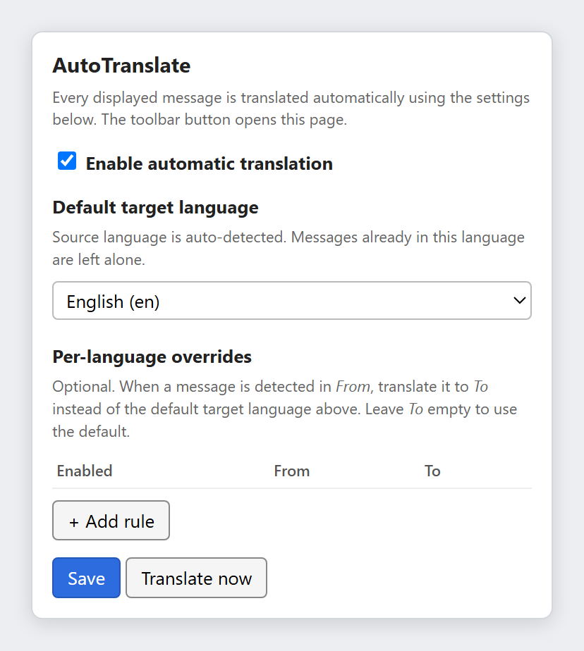

# AutoTranslate (Thunderbird Add-on)

AutoTranslate automatically translates displayed emails in Thunderbird using Google Translate. Just like how it happens on gmail automatically!

## UI Preview



## Install

1. Download `autotranslate.xpi` from the [latest release](https://github.com/Dildz/Thunderbird-AutoTranslate/releases/latest).
2. Open Thunderbird.
3. Go to **Settings** -> **Add-ons and Themes**.
4. Click the gear icon and choose **Install Add-on From File...**
5. Select `autotranslate.xpi`.
6. Confirm installation, then restart Thunderbird.

Thunderbird does not require add-ons to be signed, so the unsigned `.xpi` installs as-is.

## How to use

1. Open any email message.
2. AutoTranslate translates it automatically (if enabled).
3. Click the add-on button to open settings.
4. Set your default target language and optional per-language rules.
5. Click **Save**.
6. Use **Translate now** to force translation of the currently open message.

## Build from source

The `.xpi` is a plain zip with `manifest.json` at the root. It is a build
artifact and is not committed to the repo:

```sh
zip -r autotranslate.xpi manifest.json background.js translator.js messageDisplayScript.js options.html options.css options.js icons/
```

Run the checks with `node tests/test_translator.js`.

## Notes

- Message text is sent to `https://translate.googleapis.com/` to perform translation.
- Settings are stored locally in Thunderbird (`storage.local`).
